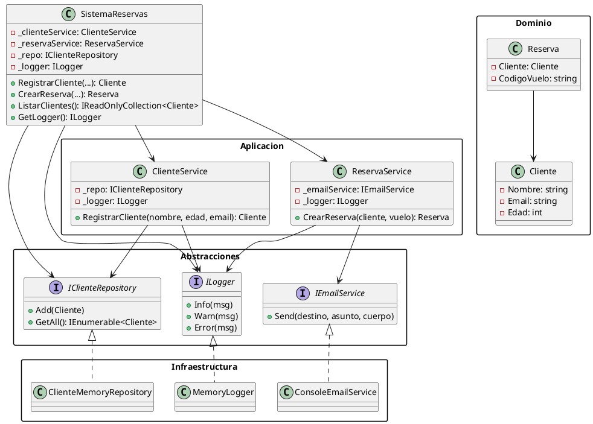

# Proyecto: Sistema de Reservas (Refactorización)

Autor: [Tu Nombre]
Fecha: 2025-09-13

---

## 1. Resumen ejecutivo
Este documento presenta la refactorización de un sistema de reservas en C# orientada a mejorar la cohesión, reducir el acoplamiento y aplicar principios SOLID y patrones de diseño. Se incluye diagrama UML, justificación y el código refactorizado y comentado.

---

## 2. Objetivos y criterios de diseño
- Alta cohesión: cada clase/servicio cumple una responsabilidad clara.
- Bajo acoplamiento: dependencias invertidas mediante interfaces.
- SOLID: SRP, OCP, LSP, ISP, DIP aplicados.
- Patrones: Fachada y Puertos/Adaptadores (Arquitectura Hexagonal).

---

## 3. Estructura de carpetas
- Abstracciones: puertos (`IClienteRepository`, `IEmailService`, `ILogger`).
- Aplicacion: servicios de caso de uso (`ClienteService`, `ReservaService`).
- Infraestructura: adaptadores concretos (`ClienteMemoryRepository`, `ConsoleEmailService`, `MemoryLogger`).
- Dominio: entidades (`Cliente`, `Reserva`).
- Fachada: `SistemaReservas` orquesta servicios.
- Entrada: `Program.cs`.

---

## 4. Diagrama de clases UML (PlantUML)
Pega este bloque en https://www.plantuml.com/plantuml para visualizarlo.



---

## 5. Justificación de la refactorización
- SRP (Single Responsibility Principle):
  - `ClienteService` gestiona altas de clientes.
  - `ReservaService` gestiona creación de reservas y notificación.
- OCP (Open/Closed Principle):
  - Nuevas implementaciones de `ILogger` o `IEmailService` se agregan sin modificar los servicios.
- LSP (Liskov Substitution Principle):
  - Implementaciones pueden sustituirse por las interfaces sin romper comportamiento.
- ISP (Interface Segregation Principle):
  - Interfaces pequeñas y específicas evitan dependencias innecesarias.
- DIP (Dependency Inversion Principle):
  - Los servicios dependen de abstracciones, no de concreciones.

Patrones utilizados:
- Fachada: `SistemaReservas` expone una API simple y orquesta dependencias.
- Puertos y Adaptadores (Hexagonal): Abstracciones en `Abstracciones`, implementaciones en `Infraestructura`.

---

## 6. Instrucciones de compilación y ejecución (Windows/PowerShell)
```powershell
Set-Location "C:\Analisis De sistemas refactorizacion"
dotnet msbuild ".\codigo refactor\refactor\refactor.csproj" /t:Build /p:Configuration=Debug
& ".\codigo refactor\refactor\bin\Debug\refactor.exe"
```

---

## 7. Repositorio del proyecto
- Repositorio publicado: https://github.com/Jhons2004/sistema-reservas-refactor

Comandos para inicializar y publicar:
```powershell
Set-Location "C:\Analisis De sistemas refactorizacion\codigo refactor\refactor"
# Ignorar binarios y artefactos
@"
bin/
obj/
.vs/
*.user
*.suo
"@ | Out-File -FilePath .gitignore -Encoding utf8 -Force

# Inicializar repo y commit inicial
git init
git add .
git commit -m "Refactor: alta cohesion, bajo acoplamiento, SOLID"

# Crear repositorio en GitHub (pasos manuales) y luego:
# git remote add origin https://github.com/Jhons2004/sistema-reservas-refactor.git
# git branch -M main
# git push -u origin main
```

---

## 8. Código refactorizado y comentado
A continuación se listan los archivos clave.

### 8.1 `Cliente.cs`
```csharp
using System;
using System.Collections.Generic;
using System.Linq;
using System.Text;
using System.Threading.Tasks;

namespace refactor
{
    /// <summary>
    /// Entidad de dominio que representa a un cliente.
    /// Se encapsulan los campos como propiedades para mejorar la cohesión y permitir validaciones.
    /// </summary>
    public class Cliente
    {
        public string Nombre { get; set; }
        public string Email { get; set; }
        public int Edad { get; set; }

        public override string ToString()
        {
            return $"{Nombre} ({Email}), {Edad} años";
        }
    }
}
```

### 8.2 `Reserva.cs`
```csharp
namespace refactor
{
    /// <summary>
    /// Entidad de dominio para una reserva.
    /// </summary>
    public class Reserva
    {
        public Cliente Cliente { get; set; }
        public string CodigoVuelo { get; set; }
    }
}
```

### 8.3 `Abstracciones/IClienteRepository.cs`
```csharp
using System.Collections.Generic;

namespace refactor.Abstracciones
{
    /// <summary>
    /// Puerto de acceso a persistencia de clientes (Arquitectura Hexagonal / Puertos y Adaptadores).
    /// </summary>
    public interface IClienteRepository
    {
        void Add(Cliente cliente);
        IEnumerable<Cliente> GetAll();
    }
}
```

### 8.4 `Abstracciones/IEmailService.cs`
```csharp
namespace refactor.Abstracciones
{
    /// <summary>
    /// Servicio para envío de correos electrónicos.
    /// Extraído para reducir acoplamiento con infraestructura.
    /// </summary>
    public interface IEmailService
    {
        void Send(string destino, string asunto, string cuerpo);
    }
}
```

### 8.5 `Abstracciones/ILogger.cs`
```csharp
namespace refactor.Abstracciones
{
    /// <summary>
    /// Abstracción de logging; permite cambiar implementación sin afectar el dominio.
    /// </summary>
    public interface ILogger
    {
        void Info(string message);
        void Warn(string message);
        void Error(string message);
    }
}
```

### 8.6 `Aplicacion/ClienteService.cs`
```csharp
using System;
using refactor.Abstracciones;

namespace refactor.Aplicacion
{
    /// <summary>
    /// Servicio de aplicación enfocado en operaciones de cliente (alta cohesión).
    /// </summary>
    public class ClienteService
    {
        private readonly IClienteRepository _repo;
        private readonly ILogger _logger;

        public ClienteService(IClienteRepository repo, ILogger logger)
        {
            _repo = repo ?? throw new ArgumentNullException(nameof(repo));
            _logger = logger ?? throw new ArgumentNullException(nameof(logger));
        }

        public Cliente RegistrarCliente(string nombre, int edad, string email)
        {
            var cliente = new Cliente { Nombre = nombre, Edad = edad, Email = email };
            _repo.Add(cliente);
            _logger.Info($"Cliente registrado: {cliente.Nombre}");
            return cliente;
        }
    }
}
```

### 8.7 `Aplicacion/ReservaService.cs`
```csharp
using System;
using refactor.Abstracciones;

namespace refactor.Aplicacion
{
    /// <summary>
    /// Servicio de aplicación para gestión de reservas.
    /// Aplica SRP, desacoplando reglas y envío de correo.
    /// </summary>
    public class ReservaService
    {
        private readonly IEmailService _emailService;
        private readonly ILogger _logger;

        public ReservaService(IEmailService emailService, ILogger logger)
        {
            _emailService = emailService ?? throw new ArgumentNullException(nameof(emailService));
            _logger = logger ?? throw new ArgumentNullException(nameof(logger));
        }

        public Reserva CrearReserva(Cliente cliente, string vuelo)
        {
            if (cliente == null) throw new ArgumentNullException(nameof(cliente));
            if (string.IsNullOrWhiteSpace(vuelo)) throw new ArgumentException("Código de vuelo inválido", nameof(vuelo));

            if (cliente.Edad < 18)
            {
                _logger.Warn($"Cliente menor de edad: {cliente.Nombre}");
                throw new InvalidOperationException("El cliente no puede reservar por ser menor de edad.");
            }

            var reserva = new Reserva { Cliente = cliente, CodigoVuelo = vuelo };
            _logger.Info($"Reserva creada para {cliente.Nombre} en vuelo {vuelo}");
            _emailService.Send(cliente.Email, "Reserva confirmada", $"Reserva confirmada en vuelo {vuelo}");
            return reserva;
        }
    }
}
```

### 8.8 `Infraestructura/ClienteMemoryRepository.cs`
```csharp
using System.Collections.Generic;
using refactor.Abstracciones;

namespace refactor.Infraestructura
{
    /// <summary>
    /// Implementación simple en memoria para persistencia de clientes.
    /// </summary>
    public class ClienteMemoryRepository : IClienteRepository
    {
        private readonly List<Cliente> _clientes = new List<Cliente>();

        public void Add(Cliente cliente) => _clientes.Add(cliente);

        public IEnumerable<Cliente> GetAll() => _clientes;
    }
}
```

### 8.9 `Infraestructura/ConsoleEmailService.cs`
```csharp
using System;
using refactor.Abstracciones;

namespace refactor.Infraestructura
{
    /// <summary>
    /// Implementación de IEmailService que utiliza la consola como salida.
    /// </summary>
    public class ConsoleEmailService : IEmailService
    {
        public void Send(string destino, string asunto, string cuerpo)
        {
            Console.WriteLine($"Enviando correo a {destino}: {asunto} - {cuerpo}");
        }
    }
}
```

### 8.10 `Infraestructura/MemoryLogger.cs`
```csharp
using System.Collections.Generic;
using refactor.Abstracciones;

namespace refactor.Infraestructura
{
    /// <summary>
    /// Logger en memoria; conserva compatibilidad con inspección de logs durante ejecución.
    /// </summary>
    public class MemoryLogger : ILogger
    {
        public List<string> Entries { get; } = new List<string>();

        public void Info(string message) => Entries.Add($"INFO: {message}");
        public void Warn(string message) => Entries.Add($"WARN: {message}");
        public void Error(string message) => Entries.Add($"ERROR: {message}");
    }
}
```

### 8.11 `SistemaReservas.cs`
```csharp
using System;
using System.Collections.Generic;
using refactor.Abstracciones;
using refactor.Aplicacion;
using refactor.Infraestructura;

namespace refactor
{
    /// <summary>
    /// Fachada del sistema que orquesta servicios de aplicación,
    /// manteniendo el nombre para compatibilidad con Program.Main.
    /// </summary>
    public class SistemaReservas
    {
        private readonly ClienteService _clienteService;
        private readonly ReservaService _reservaService;
        private readonly IClienteRepository _repo;
        private readonly ILogger _logger;

        public SistemaReservas()
        {
            // Composición por defecto (podría inyectarse desde Program para mayor flexibilidad)
            _logger = new MemoryLogger();
            _repo = new ClienteMemoryRepository();
            _clienteService = new ClienteService(_repo, _logger);
            _reservaService = new ReservaService(new ConsoleEmailService(), _logger);
        }

        public SistemaReservas(ClienteService clienteService, ReservaService reservaService, IClienteRepository repo, ILogger logger)
        {
            _clienteService = clienteService ?? throw new ArgumentNullException(nameof(clienteService));
            _reservaService = reservaService ?? throw new ArgumentNullException(nameof(reservaService));
            _repo = repo ?? throw new ArgumentNullException(nameof(repo));
            _logger = logger ?? throw new ArgumentNullException(nameof(logger));
        }

        public Cliente RegistrarCliente(string nombre, int edad, string email)
        {
            return _clienteService.RegistrarCliente(nombre, edad, email);
        }

        public Reserva CrearReserva(Cliente cliente, string vuelo)
        {
            var reserva = _reservaService.CrearReserva(cliente, vuelo);
            Console.WriteLine($"Reserva creada para {cliente.Nombre}");
            return reserva;
        }

        public IReadOnlyCollection<Cliente> ListarClientes()
        {
            // Exponer consulta de clientes registrados.
            return new List<Cliente>(_repo.GetAll()) as IReadOnlyCollection<Cliente>;
        }

        public ILogger GetLogger() => _logger;
    }
}
```

### 8.12 `Program.cs`
```csharp
namespace refactor
{
    internal class Program
    {
        static void Main(string[] args)
        {
            var sistema = new SistemaReservas();

            var cliente = sistema.RegistrarCliente("Ana", 25, "ana@mail.com");
            sistema.CrearReserva(cliente, "AV123");

            // Mostrar logs registrados (a través de ILogger)
            var logger = sistema.GetLogger();
            if (logger is Infraestructura.MemoryLogger mem)
            {
                foreach (var entry in mem.Entries)
                {
                    System.Console.WriteLine(entry);
                }
            }
        }
    }
}
```

---

## 9. Notas finales
- `Globals` fue eliminado del flujo (dejado vacío) y reemplazado por `ILogger`.
- Para persistencia real, se puede añadir `IReservaRepository` y una implementación (BD/archivo).
- Se recomienda añadir pruebas unitarias para `ClienteService` y `ReservaService`.
