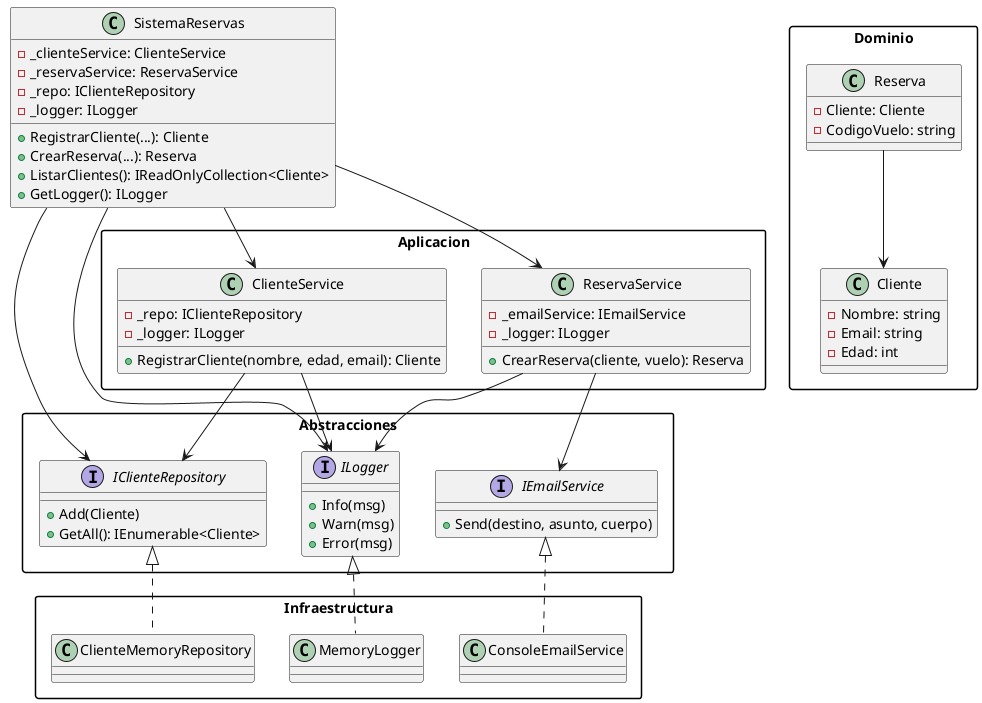

# Refactorización: Alta Cohesión, Bajo Acoplamiento, SOLID

## Objetivos
- Aumentar cohesión separando responsabilidades en servicios.
- Reducir acoplamiento introduciendo abstracciones (interfaces) y dependencias inyectables.
- Aplicar principios SOLID y patrones de diseño (Fachada, Puertos y Adaptadores).

## Estructura
- Abstracciones: puertos (`IClienteRepository`, `IEmailService`, `ILogger`).
- Aplicacion: casos de uso (`ClienteService`, `ReservaService`).
- Infraestructura: adaptadores concretos (`ClienteMemoryRepository`, `ConsoleEmailService`, `MemoryLogger`).
- Dominio: entidades (`Cliente`, `Reserva`).
- Fachada: `SistemaReservas` orquesta servicios.

## Diagrama UML (PlantUML)



## Justificación
- SRP (Single Responsibility):
  - `ClienteService` sólo gestiona operaciones de cliente; `ReservaService` sólo gestiona reservas y notificaciones.
- OCP (Open/Closed):
  - Nuevas implementaciones de `ILogger` o `IEmailService` se añaden sin modificar servicios.
- LSP: Las implementaciones de interfaces pueden reemplazarse sin romper comportamiento.
- ISP: Interfaces pequeñas y específicas (`ILogger`, `IEmailService`, `IClienteRepository`).
- DIP: Servicios dependen de abstracciones, no de concreciones.

Patrones
- Fachada: `SistemaReservas` expone una API simple, orquestando servicios.
- Puertos y Adaptadores (Hexagonal): Abstracciones en `Abstracciones` y adaptadores en `Infraestructura`.

## Cómo compilar y ejecutar
```powershell
Set-Location "C:\Analisis De sistemas refactorizacion"
dotnet msbuild ".\codigo refactor\refactor\refactor.csproj" /t:Build /p:Configuration=Debug
& ".\codigo refactor\refactor\bin\Debug\refactor.exe"
```

## Repositorio publicado
- Enlace: https://github.com/Jhons2004/sistema-reservas-refactor
